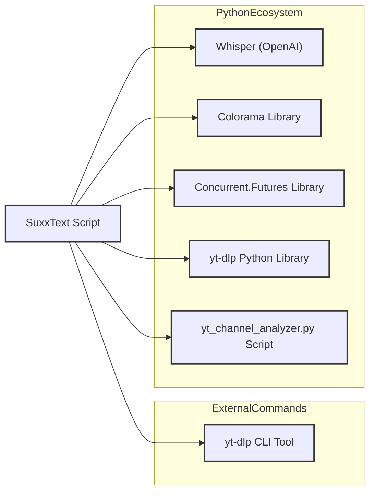

# SuxxText: YouTube Video Transcriber & Channel Analyzer 🚀


> **"SuxxText"**: Converts video content into text you can actually use. 


## 🌟 Why SuxxText?

**SuxxText** is a robust **YouTube Transcriber** and **Channel Analyzer** designed for researchers, archivists, and data lovers. Stop manually transcribing videos or relying on flaky online converters.

*   🎙️ **Offline AI Transcription**: Powered by **OpenAI Whisper** for high-accuracy speech-to-text.
*   📊 **Channel Analytics**: Download full channel history and generate **beautiful HTML reports**.
*   ⚡ **Batch Processing**: Transcribe entire playlists or channels in parallel.
*   🔒 **Privacy Focused**: Everything runs locally on your machine. No API costs, no data leaks.

---

## 🚀 Quick Start

Get up and running in seconds.

### Prerequisities
*   Python 3.8+
*   `ffmpeg` (Required for audio processing: `sudo apt install ffmpeg`)

### Installation

```bash
# 1. Clone the repository
git clone https://github.com/LuCiDDre@MS/yt-transcriber.git
cd yt-transcriber

# 2. Install dependencies
pip install -r requirements.txt

# 3. Run the tool
python3 transcribe2.py
```

*Or use the included wrapper script:*
```bash
chmod +x run.sh
./run.sh
```

---

## ✨ Key Features

| Feature | Description |
| :--- | :--- |
| **Video to Text** | Convert any YouTube video to a `.txt` transcription file. |
| **MP3 Extraction** | Automatically save the audio track as a high-quality MP3. |
| **Channel Archiver** | Download metadata for *every* video on a channel into JSON. |
| **HTML Reports** | Analyze channel performance with interactive graphs and tables. |
| **Looping CLI** | A user-friendly, colored command-line interface that keeps running. |

---

## 🛠️ Technical Overview

### Architecture

SuxxText integrates powerful tools to deliver a seamless workflow:



### Core Workflows

1.  **Single Video**: Download Audio -> Transcribe with Whisper -> Save TXT
2.  **Batch Processing**: Fetch Channel List -> Filter Existing -> Parallel Transcribe
3.  **Analytics**: Parse History JSON -> Calculate Stats -> Generate HTML Report

---

## 📜 License & Credits

**Author:** [LuCiDDre@MS]
**License:** [CC BY-NC 4.0](LICENSE) - Free to use and adapt for non-commercial purposes. Attribution required.

This project stands on the shoulders of giants. Special thanks to:
*   [**yt-dlp**](https://github.com/yt-dlp/yt-dlp): The incredible tool powering the video downloads.
*   [**OpenAI Whisper**](https://github.com/openai/whisper): The state-of-the-art AI model used for accurate transcriptions.
*   [**Colorama**](https://github.com/tartley/colorama): For making the terminal output look great.
