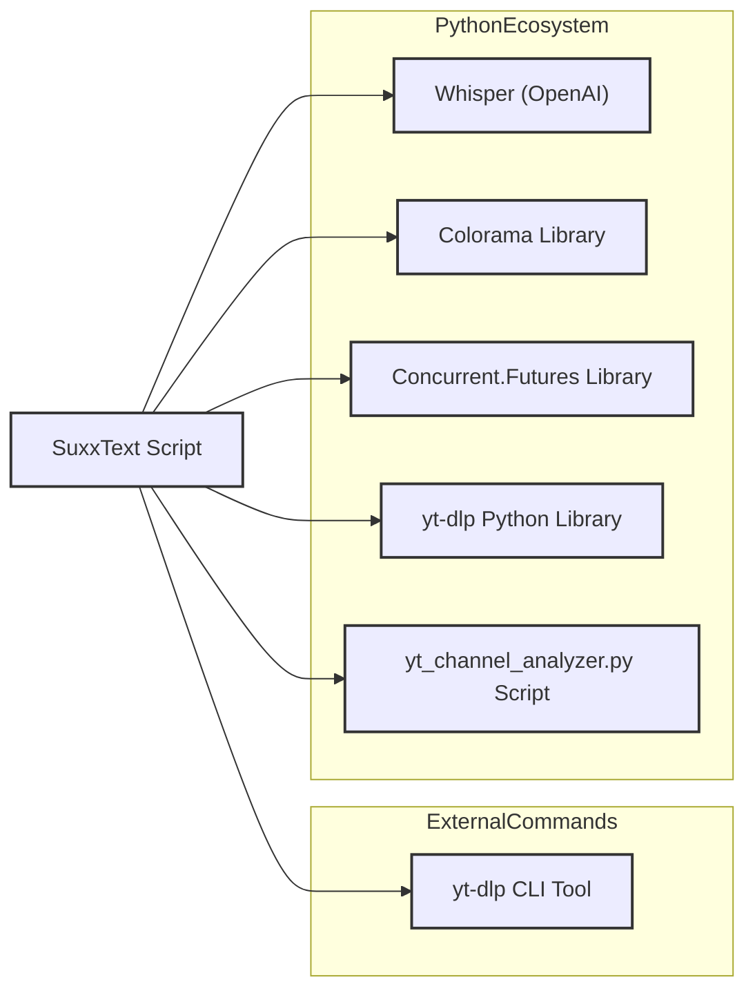

# SuxxText: YouTube Video Transcriber & Channel Analyzer 🚀


> **"SuxxText"**: Converts video content into text you can actually use. 


## 🌟 Why SuxxText?

**SuxxText** is a robust **YouTube Transcriber** and **Channel Analyzer** designed for researchers, archivists, and data lovers. Stop manually transcribing videos or relying on flaky online converters.

*   🎙️ **Offline AI Transcription**: Powered by **OpenAI Whisper** for high-accuracy speech-to-text.
*   📊 **Channel Analytics**: Download full channel history and generate **beautiful HTML reports**.
*   ⚡ **Batch Processing**: Transcribe entire playlists or channels in parallel.
*   🔒 **Privacy Focused**: Everything runs locally on your machine. No API costs, no data leaks.

---

## 🚀 Quick Start

Get up and running in seconds.

### Prerequisities
*   Python 3.8+
*   `ffmpeg` (Required for audio processing: `sudo apt install ffmpeg`)

### Installation

```bash
# 1. Clone the repository
git clone https://github.com/Reperion/SuXXteXt.git
cd SuXXteXt

# 2. Virtualenv + deps
python3 -m venv suxxtext-venv
source suxxtext-venv/bin/activate
pip install -r requirements.txt

# 3. Run (interactive menu — paste a channel link when prompted)
python -m suxxtext
# same as:
python3 transcribe2.py
./run.sh
```

### Package layout

```
suxxtext/           # library (paths, youtube, whisper, captions, jobs, pcs, cli)
transcribe2.py      # thin backward-compatible entry
yt_tldw.py          # captions-first TL;DW pipeline
fetch_captions_batch.py
yt_channel_analyzer.py
tests/              # unit tests (no network)
```

### PCS summaries (Ollama / Gemma) — problem · cause · solution

After transcripts exist, extract **fluff-free** health cards with local Ollama
(default model: `gemma4:e4b`). Built for Dr. Berg–style videos; ready to wire into the main CLI later.

```bash
# prerequisites: ollama serve + model pulled (e.g. ollama pull gemma4:e4b)
export PYTHONPATH=.
python -m suxxtext.pcs --check

# batch a channel archive
python -m suxxtext.pcs --channel Drberg

# one file
python -m suxxtext.pcs --file channels/Drberg/transcriptions/SOME.txt --channel Drberg

# symptom search over index.jsonl
python -m suxxtext.pcs --channel Drberg --search gout
```

Writes `channels/<Channel>/summaries/<video_id>.json` plus `index.jsonl`.
Each card: **problem**, **cause**, **solution** (~45–50 words each), **symptoms**,
and **related** (adjacent topics / side mentions for search).

### Large channel batches (ops)

Default CLI pipeline: **captions first → Whisper fallback**, skip-by-video_id,
gentle throttle **4 workers / 2 Whisper models**. Full playbook:
**[docs/ops-channel-batch.md](docs/ops-channel-batch.md)**.

```bash
# Preferred (agents + humans)
python -m suxxtext --mode batch --channel "@Drberg" --limit 512

# Force Whisper only / captions only
python -m suxxtext --mode batch --channel "@Drberg" --limit 50 --whisper-only
python -m suxxtext --mode batch --channel "@Drberg" --limit 50 --no-whisper-fallback

# Residual bot-blocks on Whisper downloads
export SUXXTEXT_COOKIES_FROM_BROWSER=chrome
python scripts/retry_missing_with_cookies.py Drberg /tmp/retry-ids.txt chrome

# Step 2 PCS only when Ollama is up
curl -s -m 3 http://127.0.0.1:11434/api/tags && \
  python -m suxxtext.pcs --channel Drberg
```

Helpers: `scripts/retry_missing_with_cookies.py`, `scripts/drberg_tg_progress.sh`.

---

## ✨ Key Features

| Feature | Description |
| :--- | :--- |
| **Video to Text** | Convert any YouTube video to a `.txt` transcription file. |
| **MP3 Extraction** | Automatically save the audio track as a high-quality MP3. |
| **Channel Archiver** | Download metadata for *every* video on a channel into JSON. |
| **HTML Reports** | Analyze channel performance with interactive graphs and tables. |
| **Looping CLI** | A user-friendly, colored command-line interface that keeps running. |

---

## 🛠️ Technical Overview

### Architecture

SuxxText integrates powerful tools to deliver a seamless workflow:


```mermaid
graph LR
    A[SuxxText Script] --> B["yt-dlp CLI Tool"];
    A --> C["Whisper (OpenAI)"];
    A --> D[Colorama Library];
    A --> E["Concurrent.Futures Library"];
    A --> F["yt-dlp Python Library"];
    A --> G[yt_channel_analyzer.py Script];

    subgraph ExternalCommands
        B["yt-dlp CLI Tool"]
    end
    subgraph PythonEcosystem
        C["Whisper (OpenAI)"]
        D[Colorama Library]
        E["Concurrent.Futures Library"]
        F["yt-dlp Python Library"]
        G[yt_channel_analyzer.py Script]
    end

    style A stroke:#333,stroke-width:2px
    style B stroke:#333,stroke-width:2px
    style C stroke:#333,stroke-width:2px
    style D stroke:#333,stroke-width:2px
    style E stroke:#333,stroke-width:2px
    style F stroke:#333,stroke-width:2px
    style G stroke:#333,stroke-width:2px
```

### Core Workflows

1.  **Single Video**: Download Audio -> Transcribe with Whisper -> Save TXT
2.  **Batch Processing**: Fetch Channel List -> Filter Existing -> Parallel Transcribe
3.  **Analytics**: Parse History JSON -> Calculate Stats -> Generate HTML Report

### Channel archive folders

Outputs go under `channels/<handle>/` (YouTube `@handle` when available), not the display title.  
Single and batch modes share the same resolver so archives do not split (e.g. `Drberg` not `Dr._Eric_Berg_DC`).  
Transcript filenames include the **video id** so re-runs and batch mode can skip already-done videos.

### Transcription engine

Uses **faster-whisper** with **CUDA float16** when a GPU is available, otherwise CPU int8.  
Batch mode accepts `--model` (default `base`) and `--model_instances` for parallel loads.

Keep **yt-dlp** current (YouTube breaks old builds often):

```bash
pip install -U "yt-dlp>=2026.7.4"
# or inside the project venv:
source suxxtext-venv/bin/activate && pip install -U yt-dlp
```

---

## 🧰 Extra tools (same repo)

| Script | What it does | When to use it |
| :--- | :--- | :--- |
| **`transcribe2.py`** | Download audio + Whisper STT; channel batch; history JSON; stats | Offline / no captions / highest quality archive |
| **`yt_tldw.py`** | **TL;DW** — grab **existing YouTube captions** first (fast, no GPU), optional Whisper fallback; channel latest-N; JSON summary on stdout | Quick digests, pipelines, “just give me the text” |
| **`fetch_captions_batch.py`** | Walk a saved `*-full-history.json`, pull captions into `channels/.../transcriptions/`, rate-limit + optional Whisper | Bulk backfill of an archive without re-downloading audio |
| **`yt_channel_analyzer.py`** | HTML stats from channel history JSON | Analytics reports |

### TL;DW quick examples

```bash
# One video → ./transcripts/<id>/{transcript.txt, transcript_timed.txt, metadata.json}
python3 yt_tldw.py --url "https://www.youtube.com/watch?v=VIDEO_ID"

# Latest 3 from a channel (captions only)
python3 yt_tldw.py --channel "@HubermanLabClips" --limit 3 --delay 2

# Captions missing? Fall back to Whisper (uses faster-whisper if installed)
python3 yt_tldw.py --url "VIDEO_ID" --fallback-whisper --whisper-model base

# Discover only
python3 yt_tldw.py --channel "@Drberg" --limit 5 --dry-run
```

### Caption backfill from history JSON

```bash
python3 fetch_captions_batch.py \
  --json channels/HubermanLabClips/HubermanLabClips-full-history.json \
  --limit 20 --delay 5

# Optional browser cookies for yt-dlp sub-checks / higher limits
python3 fetch_captions_batch.py --json ... --limit 10 --cookies-from-browser chrome
```

---

## 📜 License & Credits

**Author:** [LuCiDDre@MS]
**License:** [CC BY-NC 4.0](LICENSE) - Free to use and adapt for non-commercial purposes. Attribution required.

This project stands on the shoulders of giants. Special thanks to:
*   [**yt-dlp**](https://github.com/yt-dlp/yt-dlp): The incredible tool powering the video downloads.
*   [**OpenAI Whisper**](https://github.com/openai/whisper): The state-of-the-art AI model used for accurate transcriptions.
*   [**Colorama**](https://github.com/tartley/colorama): For making the terminal output look great.
