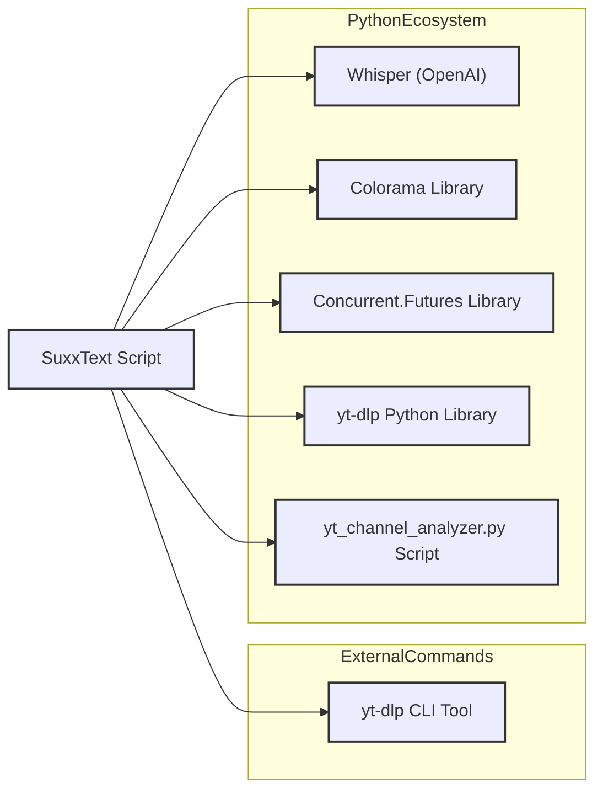
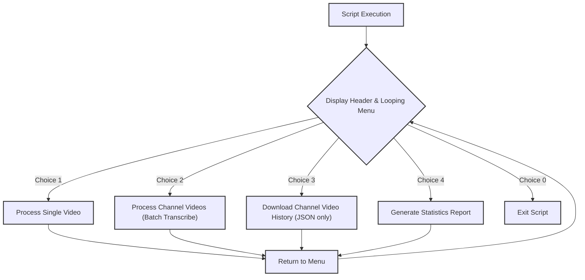
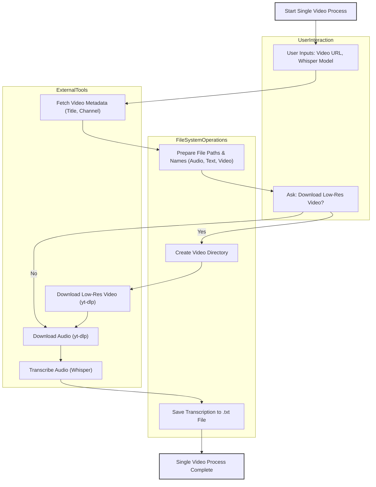
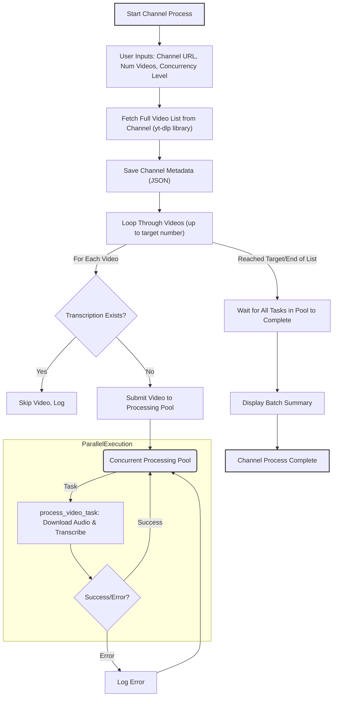
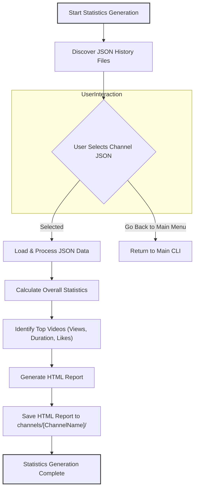
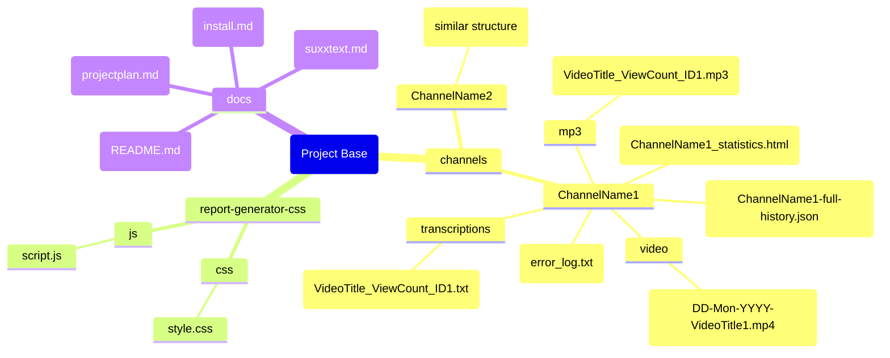

# SuxxText: YouTube Video Transcriber & Channel Analyzer - Technical Overview

**Author:** [LuCiDDre@MS]
**License:** [CC BY-NC 4.0](LICENSE) - Free to use and adapt for non-commercial purposes. Attribution required.

## Credits & Acknowledgements

This project stands on the shoulders of giants. Special thanks to the creators of:
*   [**yt-dlp**](https://github.com/yt-dlp/yt-dlp): The incredible tool powering the video downloads.
*   [**OpenAI Whisper**](https://github.com/openai/whisper): The state-of-the-art AI model used for accurate transcriptions.
*   [**Colorama**](https://github.com/tartley/colorama): For making the terminal output look great.

## 1. Introduction

Welcome to the technical overview of "SuxxText," a powerful Python script designed to download audio (and optionally video) content from YouTube, transcribe it into text, and now, analyze channel statistics. This document explains the script's architecture, the tools it leverages, and the workflows it employs, making it suitable for understanding its design and capabilities, for instance, in a classroom setting.

SuxxText can:
*   Process individual YouTube videos.
*   Batch process multiple videos from a YouTube channel.
*   Optionally download a low-resolution version of the video alongside the audio for single videos.
*   Organize downloaded media and transcriptions into a structured directory system.
*   Download full channel history as a JSON file.
*   **Generate comprehensive HTML statistics reports for YouTube channels from existing JSON history files.**
*   Utilize parallel processing for efficiency when handling multiple videos.
*   Provide a user-friendly, colored command-line interface (CLI) that loops for continuous operation.

## 2. Core Technologies & Tools

SuxxText integrates several key external tools and Python libraries to achieve its functionality.

*   **`yt-dlp` (Command-Line Tool & Python Library):**
    *   **Role:** This is the workhorse for all interactions with YouTube. SuxxText uses it to:
        *   Download audio-only versions of videos (as MP3s).
        *   Download low-resolution video files (as MP4s).
        *   Fetch metadata about videos and channels (like titles, video lists, channel names).
    *   **Usage:** The script invokes `yt-dlp` as a subprocess for direct downloads and uses its Python library (`yt_dlp`) for fetching channel information.

*   **`Whisper (OpenAI)`:**
    *   **Role:** A state-of-the-art open-source AI model for automatic speech recognition (ASR).
    *   **Usage:** Once the audio is downloaded, SuxxText feeds the MP3 file to a loaded Whisper model, which processes the audio and returns the transcribed text. The script allows users to choose different sizes of the Whisper model (tiny, base, small, medium, large), trading off speed for accuracy.

*   **`Colorama` (Python Library):**
    *   **Role:** Enables cross-platform colored terminal text.
    *   **Usage:** Used to enhance the CLI's visual appeal and readability by displaying headers, prompts, status messages, and errors in different colors.

*   **`concurrent.futures` (Python Library):**
    *   **Role:** Provides a high-level interface for asynchronously executing callables, typically using a pool of threads or processes.
    *   **Usage:** In batch channel processing mode, this library is used to download and transcribe multiple videos concurrently, significantly speeding up the overall process for large channels.

*   **`yt_channel_analyzer.py` (Python Script):**
    *   **Role:** A dedicated script for generating HTML reports with channel statistics from the JSON history files.
    *   **Usage:** Called as a subprocess from the main `transcribe2.py` script. It processes the JSON data to calculate overall channel statistics, top videos by views, duration, and likes, and presents them in a user-friendly HTML format.

*   **Standard Python Libraries:**
    *   `os`: For interacting with the operating system (e.g., creating directories, clearing the screen).
    *   `subprocess`: For running external commands like `yt-dlp` and `yt_channel_analyzer.py`.
    *   `datetime`: For timestamping filenames.
    *   `json`: For saving channel metadata.
    *   `sys`: For graceful script exit.

## 3. Script Architecture & Workflow

The script is primarily organized around a main menu that directs the user to various core processing workflows. The CLI now operates in a continuous loop until the user chooses to exit.

### 3.1. Overall Script Flow

### 3.2. Single Video Processing Workflow

This workflow handles the download and transcription of a single YouTube video.

**Steps:**
1.  **User Input:** The script prompts the user for the YouTube video URL and the desired Whisper model size.
2.  **Metadata Fetching:** It uses `yt-dlp` (via its Python library or by parsing output) to get essential video information like its title and the channel name. This is used for naming output files and directories.
3.  **Path & Filename Setup:** Based on the fetched metadata, paths and filenames for the output MP3 audio, text transcription, and optional MP4 video are constructed. This includes sanitizing names to be filesystem-friendly and adding date stamps.
4.  **Optional Video Download:**
    *   The user is asked if they want to download a low-resolution (e.g., <=480p) version of the video.
    *   If "yes," the `video` subdirectory is created, and `yt-dlp` is invoked with specific format codes to download the video.
5.  **Audio Download:** `yt-dlp` is used again, this time configured to extract only the audio in MP3 format.
6.  **Transcription:** The downloaded MP3 file is passed to the selected Whisper model. The model processes the audio and generates the text.
7.  **Saving Output:** The transcribed text is saved to a `.txt` file. All files (MP3, TXT, and optional MP4) are placed in a structured directory based on the channel name and media type.

### 3.3. Batch Channel Processing Workflow

This workflow is designed to process multiple videos from a YouTube channel, typically the latest ones, and includes parallel processing.

**Steps:**
1.  **User Input:** The script asks for the YouTube channel URL, how many of the latest videos to process (or "all"), and the number of videos to process concurrently.
2.  **Fetch Video List:** It uses the `yt_dlp` Python library to retrieve a list of all videos available on the channel, along with their metadata. This full metadata is saved to a JSON file for the user's reference.
3.  **Iterate and Filter:** The script iterates through the fetched video list (starting from the newest):
    *   **Duplicate Check:** For each video, it checks if a transcription file already exists in the output directory. If so, the video is skipped to avoid redundant processing.
    *   **Task Submission:** If the video needs processing, a task is submitted to a `ThreadPoolExecutor` from the `concurrent.futures` library.
4.  **Concurrent Processing (`process_video_task`):**
    *   Each task in the pool (representing one video) executes the `process_video_task` function.
    *   This function is a streamlined version of the single video process:
        *   It constructs filenames based on video ID, title, and view count (for uniqueness in batch mode).
        *   Downloads the audio using `yt-dlp`.
        *   Transcribes the audio using the 'base' Whisper model (hardcoded for consistency in batch mode).
        *   Saves the transcription.
        *   Handles and logs errors specific to that video.
5.  **Completion and Summary:** Once all submitted tasks are completed, the script prints a summary of the batch operation (number of videos processed, skipped, errors). Errors are also logged to an `error_log.txt` file within the channel's directory.

### 3.4. Statistics Generation Workflow

This workflow uses `yt_channel_analyzer.py` to generate comprehensive HTML reports from existing channel history JSON files.

**Steps:**
1.  **Discover JSON History Files:** The script automatically searches for `*-full-history.json` files within the `channels/` directory and its subdirectories.
2.  **User Selection:** If multiple JSON files are found, the user is prompted to select a channel from a numbered list. An option to return to the main menu is also provided.
3.  **Load & Process JSON Data:** The selected JSON file is loaded. The script extracts video entries and channel information.
4.  **Calculate Statistics:** Various statistics are calculated, including total videos, views, likes, comments, and average metrics.
5.  **Identify Top Videos:** The top 10 videos by views, duration, and likes are identified. (Note: Time-based charts are not generated due to the absence of reliable upload date data in the current JSON format).
6.  **Generate HTML Report:** An HTML report is dynamically generated, incorporating all calculated statistics and top video lists. The report includes interactive elements like a searchable video table and sortable columns.
7.  **Save HTML Report:** The generated HTML file is saved to a channel-specific directory within the `channels/` folder (e.g., `channels/Eternal-Health/Eternal-Health_statistics.html`).
8.  **Return to Main CLI:** After generation, the script pauses briefly and then returns control to the main `transcribe2.py` CLI menu.

### 3.5. File & Directory Organization

SuxxText creates a structured output to keep downloaded media, transcriptions, and reports organized.

*   **Base Directory:** All output is stored under a main `channels/` directory.
*   **Channel-Specific Directory:** Inside `channels/`, a subdirectory is created for each processed channel, named after a sanitized version of the channel's name (e.g., `channels/My-Favorite-Channel/`).
*   **Media Type Subdirectories:** Within each channel's directory:
    *   `mp3/`: Stores all downloaded MP3 audio files.
    *   `transcriptions/`: Stores all generated `.txt` transcription files.
    *   `video/`: (For single video option) Stores downloaded low-resolution `.mp4` video files.
*   **Metadata, Reports, and Logs:**
    *   `[ChannelName]-full-history.json`: (For channel processing) Contains the full metadata dump of all videos from the channel.
    *   `[ChannelName]_statistics.html`: The generated HTML statistics report for the channel.
    *   `error_log.txt`: (For channel processing) Logs any errors encountered during the batch run.
*   **Report Assets:**
    *   `report-generator-css/`: Contains the CSS and JavaScript files required for the HTML statistics reports.
*   **Documentation:**
    *   `docs/`: Contains all markdown documentation files for the project.

**Filename Conventions:**
*   **Single Video Mode:** Files are typically prefixed with the current date (`DD-Mon-YYYY-`) followed by the sanitized video title.
*   **Batch Channel Mode:** Filenames include the sanitized video title, view count, and the unique YouTube video ID to ensure no clashes and provide more context.

## 4. User Interface (CLI)

The script features an enhanced command-line interface that operates in a continuous loop:
*   **ASCII Art Header:** A custom "SuxxText" logo is displayed at startup.
*   **Colored Output:** `Colorama` is used to color different elements:
    *   Header and subtext in "Matrix Green."
    *   Prompts in Cyan.
    *   Status messages (downloading, transcribing, generating) in Blue.
    *   Success messages in Green.
    *   Error messages in bright Red.
    *   Warning messages in Yellow.
    *   Important menu options (like "Go back to main menu") in bold white.
*   **Clear Prompts:** The script guides the user through the necessary inputs for each option.
*   **Terminal Clearing:** The terminal is cleared at the start for a cleaner presentation.

## 5. Conclusion

SuxxText is a comprehensive tool for automating the process of obtaining text transcriptions and channel statistics from YouTube content. By leveraging powerful external tools like `yt-dlp` and `Whisper`, and incorporating features like parallel processing, organized output, and a user-friendly, looping CLI, it offers an efficient solution for managing YouTube content analysis tasks.
