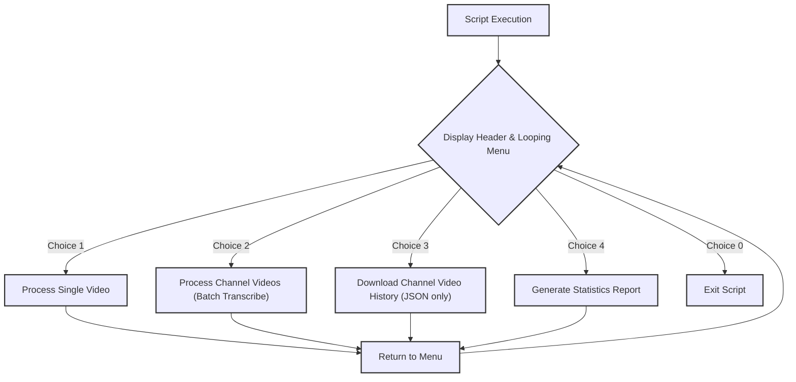
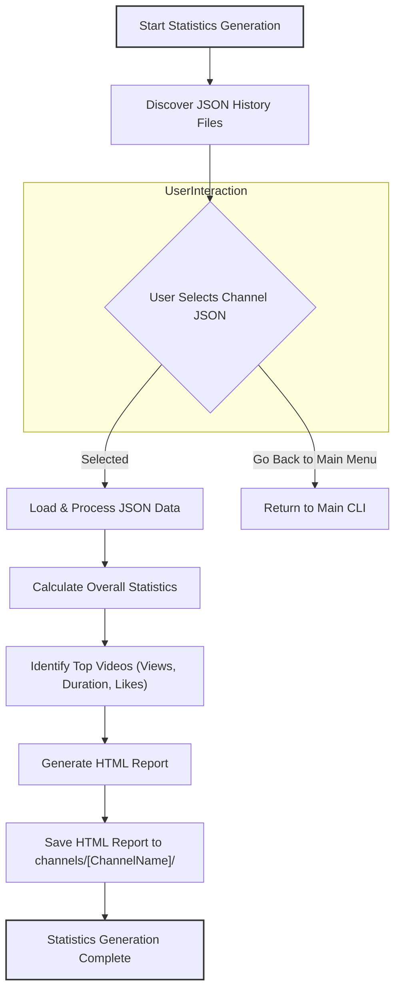

# SuxxText Project Plan and Progress

## Current Progress (as of June 2025)

The SuxxText project has evolved significantly, now offering robust YouTube video transcription and channel analysis capabilities. Key achievements include:

-   **Core Transcription Functionality:**
    -   Audio download from YouTube videos using `yt-dlp` into `channels/[ChannelName]/mp3/`.
    -   Transcription using OpenAI Whisper, saving text into `channels/[ChannelName]/transcriptions/`.
    -   Support for various Whisper model sizes (tiny, base, small, medium, large).
    -   Optional low-resolution video download for single videos.
-   **Batch Channel Processing:**
    -   Ability to fetch metadata for *all* videos from a channel using `yt-dlp`.
    -   Saving complete channel metadata to `channels/[ChannelName]/[ChannelName]-full-history.json`.
    -   Targeted processing of the latest N videos or all videos, with user-defined concurrency.
    -   Intelligent skipping of already transcribed videos for efficient resumption.
    -   Robust error logging to `channels/[ChannelName]/error_log.txt`.
    -   Improved filename conventions for clarity and uniqueness (e.g., `VideoTitle_ViewCount_ID.mp3/.txt`).
-   **Channel Statistics Generation:**
    -   Integration of `yt_channel_analyzer.py` to generate comprehensive HTML reports.
    -   Reports are saved to `channels/[ChannelName]/[ChannelName]_statistics.html`.
    -   Reports include overall channel statistics and top 10 videos by views, duration, and likes.
    -   HTML reports are styled with dedicated CSS/JS assets in `report-generator-css/`.
    -   HTML report titles link directly to the YouTube channel.
    -   Improved UI/UX for reports (renamed "Visualizations" to "Statistics", reduced padding).
-   **Enhanced Command-Line Interface (CLI):**
    -   The main `transcribe2.py` script now features a looping menu for continuous operation.
    -   New option "4. Generate Statistics" added to the main menu.
    -   Includes an "0. Exit" option for graceful termination.
    -   Incorporates a 5-second pause after statistics generation for better user flow.
    -   Improved colorama usage for better readability and user guidance.
-   **Project Organization:**
    -   All documentation files (`.md`) have been consolidated into a new `docs/` folder.
    -   Consistent filename sanitization across scripts.

## Next Steps (Future Enhancements)

-   **Timestamped Transcription Output:** Implement options for generating transcriptions with timestamps.
-   **Improved Date Handling:** Investigate alternative methods for obtaining video upload dates if `yt-dlp` continues to provide null values in certain JSON structures, to enable time-series charts.
-   **More Charting Options:** Explore additional data visualizations for the HTML reports (e.g., video duration distribution).
-   **User Configuration:** Allow users to configure default Whisper model, concurrency, etc., via a config file.
-   **Web Interface:** Consider developing a simple web-based interface for easier interaction.
-   **Error Handling Refinement:** Further refine error handling and reporting for edge cases.

## Core Workflow Diagrams

### Overall CLI Flow (`transcribe2.py`)

### Statistics Generation Workflow (`yt_channel_analyzer.py`)

## Progress Checklist

-   [x] Environment Setup
-   [x] Audio Download Module
-   [x] Transcription Module
-   [x] Implement channel video retrieval, folder organization, and parallel processing
-   [x] Implement channel statistics generation (`yt_channel_analyzer.py`)
-   [x] Integrate statistics generation into main CLI (`transcribe2.py`)
-   [x] Enhance CLI with looping menu and exit option
-   [x] Update folder structure and naming conventions
-   [ ] Add timestamped transcription output
-   [ ] Testing and Validation (Ongoing)
-   [x] Documentation (Ongoing)

## Whisper Model Sizes

-   tiny: ~70 MB, fastest but less accurate
-   base: ~140 MB, good balance of speed and accuracy
-   small: ~244 MB, more accurate but slower
-   medium: ~769 MB, higher accuracy, requires more resources
-   large: ~1.5 GB, highest accuracy, requires significant memory and GPU power

Notes:
-   1h 14 minute video (70MB MP4) took approximately 2 minutes 20 seconds to transcribe using the base model on a 380Ti RTX Mobile GPU with 16GB VRAM.
-   GPU utilization and performance for larger models have been verified.
