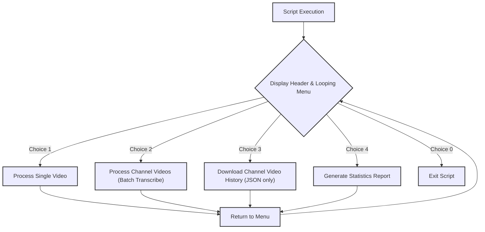
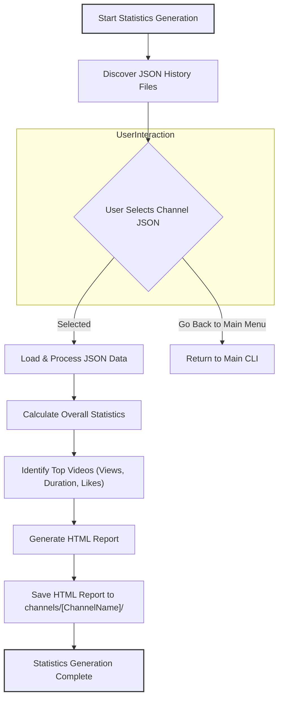

# SuXXteXt Project Plan and Progress

## Project Status: Public Release (Current as of Jan 2026)

**Repository:** `https://github.com/Reperion/SuXXteXt`

The project has transitioned from a private development tool (`yt-transcriber`) to a public open-source repository named **SuXXteXt**. It has been optimized for SEO, cleaned of sensitive data, and licensed for non-commercial use.

### Recent Major Achievements

-   **Public Release Preparation:**
    -   **Repository Rename:** Renamed to `SuXXteXt` to resolve naming conflicts.
    -   **Licensing:** Adopted **CC BY-NC 4.0** license (Attribution-NonCommercial).
    -   **Security:** Full repository scan for secrets and git history reset to ensure a clean public launch.
    -   **Attribution:** Added proper credits for core dependencies (`yt-dlp`, `Whisper`, `Colorama`) and author (`LuCiDDre@MS`).
-   **SEO & Visibility Optimization:**
    -   **Root README:** Moved and enhanced `README.md` with dynamic status badges, keywords, and a "Quick Start" guide.
    -   **Social Preview:** Designed concept for social media cards (`SOCIAL_PREVIEW_IDEA.md`).
    -   **Installation:** Added `requirements.txt` for simplified setup.
-   **Completed Core Features:**
    -   **Offline AI Transcription:** Robust local transcription with OpenAI Whisper.
    -   **Batch Processing:** Parallel processing for channel-wide downloads.
    -   **Channel Analytics:** Generation of HTML reports from channel history.

---

## Core Technologies & Tools

SuxxText integrates powerful external tools:

*   **`yt-dlp`**: Video/Audio downloading and metadata extraction.
*   **`Whisper (OpenAI)`**: State-of-the-art ASR for transcription.
*   **`Colorama`**: Enhanced terminal UI.
*   **`concurrent.futures`**: Parallel processing implementation.
*   **`yt_channel_analyzer.py`**: Custom script for HTML statistics generation.

---

## Core Workflow Diagrams

### Overall CLI Flow (`transcribe2.py`)

### Statistics Generation Workflow (`yt_channel_analyzer.py`)

---

## Progress Checklist

### Platform & Setup
-   [x] Environment Setup (Python 3.8+, ffmpeg)
-   [x] Update folder structure and naming conventions
-   [x] Create `requirements.txt`
-   [x] Establish gitignore for sensitive user data (`channels/`, `backup/`)

### Core Features
-   [x] Audio Download Module (`yt-dlp`)
-   [x] Transcription Module (`Whisper`)
-   [x] Batch Processing (Channel video retrieval, parallel execution)
-   [x] Statistics Generation (`yt_channel_analyzer.py` -> HTML)
-   [x] Enhanced CLI (Looping menu, Colorama support)

### Public Release & Docs
-   [x] Documentation Consolidated in `docs/`
-   [x] **SEO Optimization** (Root README, Badges, Keywords)
-   [x] **Public License** (CC BY-NC 4.0)
-   [x] **Git History Reset** for clean release
-   [x] Repository Rename to `SuXXteXt`

### Future Roadmap
-   [ ] **Timestamped Transcription Output:** Implement options for generating transcriptions with timestamps.
-   [ ] **Improved Date Handling:** Investigate better methods for parsing upload dates for time-series charts.
-   [ ] **More Charting Options:** Explore additional visualizations (e.g., duration distribution).
-   [ ] **User Configuration:** Config file for default model, concurrency, etc.
-   [ ] **Web Interface:** Potential future web-based UI.
-   [ ] **Testing:** Ongoing validation and edge-case handling.

---

## Whisper Model Sizes

-   **tiny**: ~70 MB, fastest but less accurate
-   **base**: ~140 MB, good balance of speed and accuracy
-   **small**: ~244 MB, more accurate but slower
-   **medium**: ~769 MB, higher accuracy, requires more resources
-   **large**: ~1.5 GB, highest accuracy, requires significant memory and GPU power

*Note: Performance validated on NVIDIA 3080Ti Mobile GPU.*
